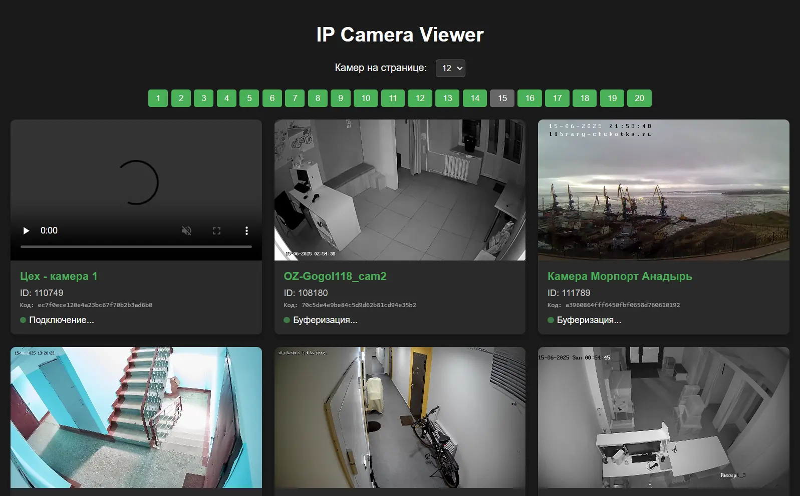

# IPEYE Parser - Парсер открытых камер с сайта ipeye.ru

Приложение для получения списка и отображения потоков IP-камер с сервера IPEYE. Программа загружает список устройств, обновляет ссылки на потоки и запускает веб-сервер для просмотра камер.



## Функциональные возможности

- Загрузка списка камер с внешнего API.
- Параллельная обработка камер для обновления URL потоков.
- Запуск веб-сервера с REST API для получения списка камер.
- Простой веб-интерфейс для просмотра камер.
- Надежное сохранение данных с использованием временного файла и атомарного переименования.


## Использование

1. Запустите программу:

```powershell
.\ipeye-parser.exe
```

2. Появится меню с тремя вариантами действий:

   - **Обновить камеры** – загрузка и обновление списка камер.
   - **Просмотр камер** – запуск веб-сервера и открытие браузера для просмотра камер.
   - **Выйти** – завершение работы приложения.

3. При выборе пункта **Просмотр камер** откроется веб-сервер, доступный по адресу `http://localhost:8080`. Веб-интерфейс находится в каталоге `./static`, а API для получения данных доступно по пути `/cameras`.
